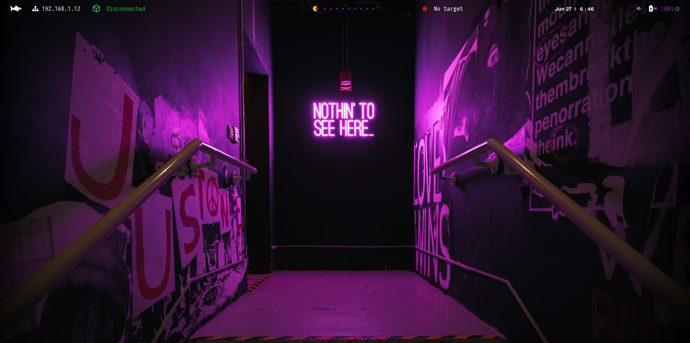

# Entorno de S4vitar en Linux 100% Funcional


👋 Bienvenido
Esta es una guía de personalización del entorno de S4vitar en Linux, adaptada y mejorada para lograr una instalación completa, funcional y visualmente atractiva.

🛠️ Este script se basa en el trabajo original del usuario [Balthael](https://github.com/Balthael), pero ha sido modificado para:

- Automatizar completamente la instalación del entorno.
- Corregir errores y problemas que presenta el script original en sistemas como Parrot OS.
- Optimizar el proceso para dejar todo listo con una sola ejecución.

Aquí encontrarás todos los pasos necesarios para dejar tu sistema al estilo S4vitar, incluyendo atajos, herramientas visuales y configuraciones listas para usar.
 
## 📜 Descripción
Este script está diseñado para sistemas operativos Linux en inglés. Si tu sistema está en español, simplemente reemplaza "Downloads" por "Descargas" dentro del archivo install.sh.

## 🎥 Tutorial paso a paso
Puedess seguir el video tutorial completo en mi [canal de YouTube](https://www.youtube.com/@CristianSinH-Ciber).
Si te resulta útil el contenido, no olvides suscribirte y seguirme en [LinkedIn](https://www.linkedin.com/in/cristian-hsilva).


## Instalación

Clona el repositorio y prepara la instalación con los siguientes comandos:

```bash
git clone https://github.com/Evil-Noctulo/Entorno-Linux
cd Entorno-Linux
chmod +x install.sh
sudo ./install.sh
```


Después de la instalación, asegúrate de seleccionar BSPWM
 

### Instalación de NVChad y problema con nvim

puede que al usar nvim tengamos este error

```jsx
Error detected while processing /home/noctulo/.config/nvim/init.lua:
E5113: Error while calling lua chunk: /home/noctulo/.config/nvim/init.lua:7: attempt to index field 'uv' (a nil value)
stack traceback:
/home/noctulo/.config/nvim/init.lua:7: in main chunk
```

**Correción de Nvim**

actualizar kitty nuevamente pero ahora de forma manual.

`curl -L https://sw.kovidgoyal.net/kitty/installer.sh | sh`

```bash
sudo su # usar estos comandos de forma individual
cd # usar estos comandos de forma individual

git clone https://github.com/NvChad/starter ~/.config/nvim
mkdir /opt/nvim
cd /opt/nvim
mv /home/USUARIO/Entorno-Linux/neovim/nvim-linux64 .
cd /opt/nvim/nvim-linux64/bin
./nvim
```

Ahora con el usuario normal

```bash
cd # usar estos comandos de forma individual
git clone https://github.com/NvChad/starter ~/.config/nvim
nvim
```

ahora debemos crear un alias. Lo hacemos como root y usuario no privilegiado

```bash
echo 'alias nvim="/opt/nvim/nvim-linux64/bin/nvim"' >> ~/.zshrc
source ~/.zshrc
```

`sudo rm /usr/bin/kitty`

```bash
sudo tee /usr/local/bin/kitty > /dev/null << 'EOF'
#!/usr/bin/env bash
exec "$HOME/.local/kitty.app/bin/kitty" "$@"
EOF
sudo chmod +x /usr/local/bin/kitty
```

Modificar sxhkdrc

`sudo nvim ~/.config/sxhkd/sxhkdrc`

`/usr/local/bin/kitty`

reiniciamos sxhkd

`pkill -USR1 -x sxhkd`

Eliminamos nvim obsoleto

`sudo rm -f /usr/local/bin/nvim` 

`sudo ln -s /opt/nvim/nvim-linux64/bin/nvim /usr/local/bin/nvim`

Cargar zsh en root

`sudo chsh -s /usr/bin/zsh root`

modificar target

`sudo chown "$USER:$USER" "$HOME/.config/bin/target"`

### Otros problemas

Si encuentras un error al cambiar al usuario root, sigue estos pasos para corregirlo:


Solución:

```bash
Ctrl + C
compaudit
chown root:root /usr/local/share/zsh/site-functions/_bspc
exit
```
Otro problema ee que la pantalla se nos vea asi, y para solucionarlo apreta: 
`win + shift + r` 
automatizar este proceso modificando el bspwmrc agregando la siguiente linea al final del archivo:
`win + shift + r`


## Configurar zsh

`nano ~/.p10k.zsh`

y agregar estas 3 líneas

Comentamos todo el bloque


## 📁 Rutas de Configuración
A continuación se detallan las rutas donde se almacenan los archivos de configuración de los componentes principales del entorno:

Polybar(Barra):
~/.config/polybar/current.ini

bspwm:
~/.config/bspwm/bpwmrc

sxhkd (shortcuts):
~/.config/sxhkd/sxhkdrc

Picom (compositor):
~/.config/picom

Atajos (Personalización de entorno en Linux)

| Combinación           | Acción                                   |
| --------------------- | ---------------------------------------- |
| `Windows + Enter`     | Abrir Terminal                           |
| `Windows + Q`         | Cerrar Terminal                          |
| `Windows + D`         | Abrir Rofi                               |
| `Windows + Esc`       | 'Aplicar' la configuración               |
| `Windows + Shift + R` | Recargar Entorno                         |
| `Windows + Shift + Q` | Volver a la pantalla de bloqueo          |
| `Esc + Esc`           | Sudo                                     |
| `Ctrl + Alt + Mouse`  | Seleccionar copiar/pegar en modo Columna |
| `Windows + Shift + X` | Bloquear Entorno                         |

#### 🔹 Polybar

|Combinación|Acción|
|---|---|
|`Windows + 1 - 0`|Desplazamiento por ventanas|
|`Windows + Shift + 1 - 0`|Enviar el proceso actual a otra ventana de trabajo|

#### 🔹 Preselectores

|Combinación|Acción|
|---|---|
|`Windows + Ctrl + Alt + Flechas`|Abrir Preselector|
|`Windows + Ctrl + Alt + Espacio`|Cerrar Preselector|
|`Windows + Ctrl + 1 - 0`|Cambiar tamaño del Preselector|
|`Windows + Ctrl + M`|Seleccionar proceso y enviarlo a un Preselector nuevo|
|`Windows + Y`|Aplicar proceso previamente seleccionado|

#### 🔹 Terminal

|Combinación|Acción|
|---|---|
|`Windows + S`|Ejecutar Terminal de forma Ventana Flotante (Screen Floating)|
|`Windows + F`|Ejecutar Terminal de forma Pantalla Completa (Full Screen)|
|`Windows + T`|Ejecutar Terminal de forma Encajada (Terminal)|
|`Windows + Click Izquierdo`|Mover la ventana flotante (Mouse)|
|`Windows + Click Derecho`|Ampliar o reducir el tamaño de la ventana (Mouse)|
|`Windows + Ctrl`|Mover ventana flotante (Atajo)|
|`Windows + Alt`|Ampliar o reducir el tamaño de la ventana (Atajo)|
|`Windows + Shift + Flechas`|Intercambiar terminal de Izquierda/Derecha/Arriba/Abajo|

#### 🔹 Kitty

|Combinación|Acción|
|---|---|
|`Ctrl + Shift + Enter`|Abrir terminal o múltiples|
|`Ctrl + Shift + W`|Cerrar terminal|
|`Ctrl + Shift + R`|Ampliar o reducir tamaño de la terminal (T=Arriba S=Abajo)|
|`Ctrl + Shift + T + número`|Nueva pestaña/etiqueta|
|`Ctrl + Shift + Alt + T`|Renombrar|
|`Ctrl + Shift + Alt + , / .`|Desplazamiento por pestañas (Signo coma o punto)|

#### 🔹 FZF

|Combinación|Acción|
|---|---|
|`Ctrl + R`|Buscar por el Historial (utiliza Flechas para desplazarte)|
|`wh Ctrl + T`|Te mueves por lo que hayas escrito anteriormente (`escribes wh`)|
|`cd ** Ctrl + T`|Buscar directorios (`escribes cd**`)|
|`rm Ctrl + T`|Seleccionas con TAB archivos a eliminar y con ENTER aceptas (`escribes rm`)|

---

📬 Contacto
Si tienes preguntas o necesitas ayuda, no dudes en escribirme a través de mi perfil de [LinkedIn](https://www.linkedin.com/in/cristian-hsilva).

¡Gracias por tu interés y apoyo!

